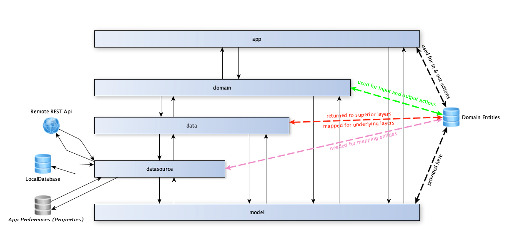

# Proyecto (Template) Compose4Desktop 

## Introducción

Este proyecto pretende mostrar cómo realizar un desarrollo multiplataforma (Windows / MacOs / Linux) para
aplicaciones de escritorio utilizando la tecnología KMP (Kotlin MultiPlatform) y JetPackCompose4Desktop.

Para el desarrollo de este proyecto se ha seguido una arquitectura de separación por módulos siguiendo el patrón
MVVM, en los que cada módulo es independiente del resto (por lo que no conoce de la existencia tanto de módulos 
de nivel superior, como de módulos que no estén en un nivel inmediatamente inferior). De este modo garantizamos 
que un programador (malintencionado o no) no podrá acceder desde la capa de presentación (por ejemplo) a la capa
de comunicaciones y acceso a datos.

## Estructura del Proyecto

Este proyecto se estructura en cinco capas (cuatro de ellas módulos de librería estandar y un quinto - presentación - 
de tipo KMP, que es el responsable de la creación de todo el sistema de vistas y ejecución de la aplicación de 
escritorio). A continuación, se enumeran las distintas capas, desde las superiores a las inferiores:

- **jvmMain**, es, además de la capa de presentación, la capa principal del proyecto, siendo su tipo de módulo KMP,
es la que alberga tanto composables, viewmodels, etc, como la configuración de despliegue y ejecución.
- **domain**, este es el módulo encargado de centralizar los distintos casos de uso y lógica de negocio necesarios 
para la obtención de datos desde fuentes de datos tanto locales como externas (ya con entidades de dominio) que serán 
pasados a la capa de presentación para su visualización.
- **data**, esta cada será la responsable de abstraer y organizar las distintas fuentes de datos, teniendo como 
fuentes de entrada y salida de datos a objetos de dominio, internamente, gracias a los mapeadores que se definirán
para cada tipo de entidad (cache, remote o domain) se podrán enviar los datos necesarios para cada tipo de acción
  (envío / recepción de datos a sistemas externos, almacenamiento en bases de datos, etc).
- **datasource**, en esta capa se definirán **todas las posibles fuentes de datos** de nuestra aplicación, lo cual 
incluye:
  - _Persistencia local de datos_, para este proyecto he elegido [Jetbrains Exposed](https://github.com/JetBrains/Exposed) 
  como ORM debido a su versatilidad 
  - _Acceso a APIs remotas_, he seleccionado [KtorClient](https://ktor.io/) ya que se ha convertido en un estandar 
  de facto, además de ser tremendamente potente.
  - _Almacenamiento de opciones de aplicación_, para esta funcionalidad me he basado en 
  [JetpackDataStore](https://developer.android.com/topic/libraries/architecture/datastore) para desplegar mi propio 
  sistema de preferencias reactivo, para ello, he utilizado un FileWatcher que monitoriza las modificaciones a un
  fichero de preferencias clásico en la JVM, emitiendo en un flow las modificaciones que configuremos. Es una 
  aproximación muy inicial, pero que creo que didácticamente muestra la potencia de los flow y los FileWatchers, 
  trabajando en paralelo.
- **models**, esta capa es transversal al resto, siendo por ello **la única visible para los demás módulos**. En esta 
capa, nos encontraremos con lo siguiente:
  - _Entidades de dominio_, organizadas por feature (idealmente).
  - _Interfaces de apoyo_, entre las que destaca por su propia naturaleza e importancia **KoinModuleLoader** (esta 
  interfaz es la responsable de que Koin sea capaz de ver y proveer las dependencias entre capas que no son visibles
  entre sí).
  - _Métodos de extensión_, también se definen algunos métodos de extensión (formateos, conversiones, etc) que pueden
  ser útiles en todo el proyecto.

## Características y funcionalidades implementadas

Puesto que este proyecto está ideado como una plantilla, con la cual acelerar el inicio de un nuevo proyecto, se le han
dotado de serie de algunas funcionalidades / configuraciones que van a permitirnos arrancar de forma mucho más rápida 
nuestro desarrollo, evitando por tanto pérdidas de tiempo innecesarias.

Se enumeran a continuación las funcionalidades implementadas por defecto:

- [Corrutinas](https://developer.android.com/kotlin/coroutines), todo el proyecto está implementado pensando en la utilización de corrutinas a todos los niveles.
- [Flow](https://developer.android.com/kotlin/flow), ya que utilizamos corrutinas, ¿por qué no utilizar Flows?
- [Jetbrains Exposed](https://github.com/JetBrains/Exposed) para persistencia en bases de datos, este ORM desarrollado por
Jetbrains está diseñado por y para Kotlin, siendo tremendamente versátil, ya que puede conectar con cualquier base de
datos que soporte [JDBC](https://es.wikipedia.org/wiki/Java_Database_Connectivity) y/o [JPA](https://es.wikipedia.org/wiki/Java_Persistence_API).
- [Ktor Client](https://ktor.io), para acceso a APIs remotas (y mucho más), se ha convertido por derecho propio en un estandar
siendo incluso una grandísima alternativa a Retrofit en sistemas Android (en KMP no se dispone de Retrofit, por lo que 
Ktor es la alternativa natural).
- [Jetpack Compose para Escritorio](https://www.jetbrains.com/lp/compose-desktop/), como motor de generación de UI reactivo.
gracias a Compose, el desarrollo de UIs de escritorio es prácticamente idéntico al desarrollo de UIs en dispositivos Android,
con las grandes ventajas que ello conlleva.

## Descripción de funcionalidades más representativas

En el punto anterior hemos podido comprobar que el proyecto integra de base numerosas funcionalidades (lás típicas para
una aplicación de escritorio), las cuales, en su inmensa mayoría son, o funciones que proporciona el propio lenguaje,
o frameworks estándar que ya disponen de una documentación (y comunidades) extremadamente completas, por lo que escapa
al alcance de este documento su explicación.

En cambio, sí vamos a ver a continuación lo que hace diferente al proyecto y que, en mi humilde opinión, beneficia y 
acelera el desarrollo de una nueva aplicación.

### 1. Provisión de dependencias con Koin
Este proyecto, como hemos comentado utiliza Koin como proveedor de dependencias, que en la versión utilizada (no implementa [Koin Annotations](https://insert-koin.io/docs/reference/koin-annotations/annotations))
sino la forma clásica de Koin), en teoría app debería tener acceso a todas las capas en las que se van a realizar mapeos ya que hay que pasarle todas
las llamadas necesarias con sus respectivos controladores.  
Esto a mi juicio, choca frontalmente con la separación por capas que se promueve en las guías de
Clean Architecture, permitiendo por ejemplo, que un programador, malintencionado o no, utilice métodos
y / o clases en una capa que no está pensada para ese uso. Con el sistema que he implementado, esto no sucede, ya que
desde una capa superior no se puede acceder a una capa inferior (desde presentación no se puede acceder a data o datasource).  
Lo descrito en el párrafo anterior queda claramente definido en el siguiente esquema:



Para implementar los inyectores de dependencia, en cada capa deberá existir un package llamado "**di**"
que será el que contenga la clase que implementará las dependencias de la capa anterior, unida a la capa actual, por ejemplo,
pensemos en la capa **data**, queremos inyectar sus propias dependencias, además de las de datasource (**que deberán ir primero** para
evitar problemas de inyección, ya que **Koin requiere de orden en función de las dependencias entre clases**).
A continuación, se expone un ejemplo de código de configuración de la provisión de dependencias de un módulo concreto:

```koin
package io.github.afalabarce.compose.desktop.data.di

import io.github.afalabarce.compose.desktop.data.preferences.PreferencesRepository
import io.github.afalabarce.compose.desktop.data.preferences.PreferencesRepositoryImpl
import io.github.afalabarce.compose.desktop.datasource.di.DataSourceModuleInjection
import io.github.afalabarce.compose.desktop.models.interfaces.KoinModuleLoader
import org.koin.core.module.Module
import org.koin.dsl.module

object DataModuleInjection: KoinModuleLoader {
    override fun getKoinModules(): List<Module> =
        DataSourceModuleInjection.getKoinModules()
            .union(listOf(
                module {
                    single<PreferencesRepository> { PreferencesRepositoryImpl(get()) }

                    // TODO add some dependencies. Be careful with dependencies ordering
                }
            )
        ).toList()
}
```

En el código anterior vemos que la clase **DataModuleInjection** implementa la interfaz **KoinModuleLoader**
la cual define un método getKoinModules, como podemos ver, en primer lugar llamamos al proveedor de dependencia de la
capa datasource (llamado **DataSourceModuleInjection**), para a continuación, agregar sus propias dependencias,
mediante la función de extensión union.  

De este modo, conseguimos que todas las dependencias vayan en el orden adecuado, además de disponer de un mapa de
dependencias más claro, ya que cada capa sólo implementa las suyas propias.

Este proceso, se repetirá en cada capa, hasta llegar a la capa de presentación, en la cual, en la función main, tan solo
deberemos agregar lo siguiente:

```kotlin
package io.github.afalabarce.compose.desktop

import androidx.compose.ui.res.painterResource
import androidx.compose.ui.text.intl.Locale
import androidx.compose.ui.window.Window
import androidx.compose.ui.window.WindowPlacement
import androidx.compose.ui.window.WindowState
import androidx.compose.ui.window.application
import io.github.afalabarce.compose.desktop.composables.features.main.composables.MainScreen
import io.github.afalabarce.compose.desktop.di.UiModuleInjection
import io.github.afalabarce.compose.desktop.utilities.stringResource
import org.koin.core.context.startKoin

fun main() = application {
    startKoin {
        modules(UiModuleInjection.getKoinModules())
    }

    Window(
        state = WindowState(WindowPlacement.Maximized),
        icon = painterResource("mipmap/ic_launcher.png"),
        title = Locale.current.stringResource("app_name"),
        onCloseRequest = ::exitApplication
    ) {
        MainScreen()
    }
}
```

Como podemos ver, en nuestra función main() tan solo debemos inyectar los módulos de presentación
(este ya lleva el resto de los módulos de las distintas capas).

### Inyección de componentes en Composables

Koin permite (mediante la inclusión de una dependencia específica) la provisión sencilla de dependencias
en los composables, para ello, en la definición del composable podremos inyectar, por ejemplo, un ViewModel.
Esto se ve en el siguiente código de ejemplo:
```kotlin
package io.github.afalabarce.compose.desktop.composables.features.main.composables

import androidx.compose.desktop.ui.tooling.preview.Preview
import androidx.compose.material.Button
import androidx.compose.material.MaterialTheme
import androidx.compose.material.Text
import androidx.compose.runtime.*
import io.github.afalabarce.compose.desktop.composables.features.main.viewmodels.MainViewModel
import org.koin.java.KoinJavaComponent.get

@Composable
@Preview
fun MainScreen(viewModel: MainViewModel = get(MainViewModel::class.java)) {
    var text by remember { mutableStateOf("Hello, World!") }
    val isFirstLoad by viewModel.isFirstAppExecution.collectAsState()

    MaterialTheme {
        Button(onClick = {
            text = "Hello, ${ if (isFirstLoad) "First" else ""} Desktop!"
            viewModel.setFirstLoad(false)
        }) {
            Text(text)
        }
    }
}
```

Como vemos en el código anterior, con tan sólo indicar 
```kotlin
viewModel: MainViewModel = get(MainViewModel::class.java)
```

ya se nos provee la dependencia. Como curiosidad, en la documentación de Koin se indica que sólo
sería necesario indicar get(), pero no ha funcionado, por lo que en este caso, indicandolo como se 
muestra anteriormente, funciona perfectamente y se realiza la provisión de las dependencias.

### 2. Mapeo de entidades Cache - Remote - Domain

Otra de las problemáticas de las implementaciones Clean Architecture está en decidir qué modelado de entidades se va a seguir.  
En un modelo clásico de implementación en el que nuestra aplicación dispone de orígenes de datos remotos y almacenamiento local,
lo más común es definir tres tipos de entidades, cada una con sus peculiaridades:
- **remote**, este tipo de entidad permite obtener datos de un origen de datos remoto, obtenidos, por ejemplo, con KtorClient. Estos
  datos van a tener una estructura que va a venirnos impuesta por el servicio backend, por lo que probablemente no se adecúe a nuestras
  necesidades particulares, simplemente necesitamos obtenerlos del sistema remoto con la estructura dada.
- **cache**, este tipo de entidad permite gestionar datos propios en nuestra base de datos, van a tener una estructura atómica, es decir,
  campos con tipos de datos primitivos, que van a ser almacenados en la base de datos.
- **domain**, este tipo de entidad es el que se va a utilizar en las capas superiores de la app. A partir de la capa **data** todo lo que se comunique
  como entrada y salida de sus métodos serán entidades de dominio (internamente utilizará las entidades de cache o remote necesarias para realizar
  su trabajo).

En mis plantillas Android ([MVVMProject](https://github.com/afalabarce/MVVMProject) y [MVVMProject-Hilt](https://github.com/afalabarce/MVVMProject-Hilt)) 
utilizaba interfaces para determinar el flujo de mapeo entre entidades, pero a raíz de implementar su uso he visto 
que este sistema es demasiado rígido, por lo que como recomendación a la hora de mapear entidades de distintos tipos, 
es más potente y sobre todo, más versátil, el uso de funciones de extensión, eso sí, organizándolas adecuadamente, cada 
grupo de mapeadores en sus distintas features.

En un sistema clásico de mapeo, se crearían clases mapeadoras para cada entidad, que serían dependientes unas de otras,
con los posibles problemas que podría ocasionarnos con Koin, además de que tendríamos una cantidad de código más complejo de mantener.
Con esta implementación una entidad tiene "todos sus mapeadores dentro de ella misma (entrecomillado, ya que son funciones de extensión)", 
por lo que no depende de entidades externas, más allá de la dependencia con las clases remote o domain (en el caso de tratarse de 
entidades de caché) y viceversa.

#### Valoración final del sistema de mapeo.

Como podemos ver, este sistema de mapeo es bastante simple, a la par que potente (creo), nos permite gestionar el intercambio de datos
entre distintos orígenes de datos de forma muy sencilla, además descarga de trabajo al proveedor de dependencias, por lo que el rendimiento
debe ser bastante mejor que implementando mapeadores "clásicos".  
Por tanto, quizá es una idea que puede ser tenida en cuenta para tus desarrollos (o no 😉).

### 3. Gestión de recursos (imágenes, textos, etc.)

En KMP no existe como tal un sistema de gestión de recursos al uso como del que disponemos en Android, por lo que, mientras no se proporcione
un sistema más versátil (y potente), se me ocurrió implementar algo similar a lo que tenemos en Android, pero quizá un poco más rudimentario.
En los siguientes párrafos paso a describir la solución que he adoptado:

Para comenzar, en la carpeta de resources del proyecto he creado unos directorios especiales, que serán los responsables
de contener los recursos (este sistema, por tanto, es ampliable, según las necesidades presentes o futuras):
- **Carpeta mipmap**, contendrá las imágenes que utilizaremos en nuestra aplicación.
- **Carpeta values**, contendrá diversos recursos, entre los que se encuentran ficheros con el patrón strings.[lang].locale,
donde [lang] es un valor opcional en el que definimos el idioma de las cadenas a incluir (y localizar), en caso de que no
exista y el fichero se llame strings.locale, estaremos ante el fichero que contiene los textos por defecto para nuestra aplicación.

#### Utilización de los recursos

Para utilizar los distintos recursos, tan sólo vamos a hacer uso de ciertas funciones de extensión, que nos van a facilitar
el trabajo, así pues:

- _Obtención de recursos de cadenas_, para obtener cadenas de caracteres, tan sólo deberemos utilizar el método de extensión
a Locale stringResource():
```kotlin
val appName = Locale.current.stringResource("app_name")
```

Con el código anterior, obtendremos el texto que se identifica por la clave "app_name", en caso de no existir traducción 
para el idioma actual, intentará obtener el valor de strings.locale, esto es, el valor por defecto, y en caso de no existir
en el catálogo por defecto, se devolverá exactamente la clave proporcionada.

- _Obtención de recursos de imágenes_, para la obtención de imágenes, tan sólo deberemos hacer uso de la función painterResource() 
proporcionada por kmp, la cual nos devolverá el recurso de imagen identificado por la ruta dada, por ejemplo:

```kotlin
val appIcon = painterResource("mipmap/app_logo.png")
```

### 4. Gestión de Preferencias generales (FileWatcher - Properties - Flow)

Para KMP actualmente (04/2.023) no existe soporte de un sistema de preferencias como JetpackDataStore, por lo que normalmente
cada desarrollador busca soluciones de su interés. Debido lo comentado en la frase anterior, he desarrollado mi propio sistema
de preferencias reactivo (con pretensiones de poder extenderlo fácilmente) basado en Flow.

Puesto que reinventar la rueda sólo hay que hacerlo en contadas ocasiones, he reutilizado un sistema probado y totalmente soportado
por la JVM como es el uso de ficheros con extensión _properties_, los cuales se gestionan con la entidad Java "Properties" de una forma
relativamente sencilla.

**El principal inconveniente** con el que nos encontramos **al utilizar Properties** es el mismo que teníamos con SharedPreferences en Android,
esto es, **no es un sistema reactivo**, por lo que le he dado una pequeña vuelta de tuerca y utilizando un FileWatcher y Flows, he podido
diseñar un sistema totalmente reactivo a cambios, lo cual, es más que interesante a la hora de desarrollar aplicaciones.

#### Solución al problema

Puesto que el sistema de preferencias es un sistema de entrada / salida y es "una fuente de datos", toda su implementación
se ubica en el módulo **datasources**, concretamente en el package de la plantilla **io.github.afalabarce.compose.desktop.datasource.preferences**.

Al igual que el resto de elementos procedentes de datasource, sus funcionalidades se definirán en una interface, 
la cual expondrá métodos y propiedades que nos van a permitir gestionar los distintos flow y configuraciones:

```kotlin
package io.github.afalabarce.compose.desktop.datasource.preferences

import io.github.afalabarce.compose.desktop.models.engines.DatabaseEngine
import kotlinx.coroutines.flow.Flow

interface PreferencesStore {
    val databaseEngine: Flow<DatabaseEngine>
    val firstLoad: Flow<Boolean>

    suspend fun setDatabaseEngine(engine: DatabaseEngine)
    suspend fun setFirstLoad(isFirstLoad: Boolean)
}
```
Como vemos, para lectura reactiva disponemos de flows, para la modificación de elementos, disponemos de funciones
de suspensión, ya que, en último término, estamos manipulando E/S de disco, y esto debe hacerse en un hilo secundario,
esto es, una corrutina.

La implementación de la interfaz es un poco compleja, pero la veremos en detalle, a continuación se expone su código completo,
el cual se explicará bloque a bloque posteriormente, a fin de conocer la metodología para extender sus funcionalidades:

```kotlin
package io.github.afalabarce.compose.desktop.datasource.preferences

import io.github.afalabarce.compose.desktop.models.engines.DatabaseEngine
import kotlinx.coroutines.CoroutineScope
import kotlinx.coroutines.Dispatchers
import kotlinx.coroutines.flow.Flow
import kotlinx.coroutines.flow.channelFlow
import kotlinx.coroutines.withContext
import java.io.File
import java.io.FileOutputStream
import java.nio.file.*
import java.util.*

internal class PreferencesStoreImpl: PreferencesStore, CoroutineScope by CoroutineScope(Dispatchers.IO) {
    private val propertiesPath: String = System.getProperty("user.dir")
    private val propertiesWatcherKey: WatchKey
    private val propertiesWatcher: WatchService = FileSystems.getDefault().newWatchService()
    private val propertiesFile: File

    init {
        val absolutePropertiesPath = "${this.propertiesPath}${File.separator}settings.properties"
        propertiesFile = File(absolutePropertiesPath)

        if (!propertiesFile.exists())
            propertiesFile.createNewFile()

        propertiesWatcherKey = File(this.propertiesPath).toPath().register(
            propertiesWatcher,
            StandardWatchEventKinds.ENTRY_MODIFY,
        )
    }

    //region private properties and methods

    private lateinit var propertiesStore: Properties
    private val properties: Properties
        get() {
            if (!::propertiesStore.isInitialized) {
                loadProperties()
            }

            return propertiesStore
        }

    private fun loadProperties() {
        propertiesStore = Properties().apply {
            load(propertiesFile.inputStream())
            propertiesFile.inputStream().close()
        }
    }

    private val Properties.databaseEngine
        get() = when(this.getOrDefault("DatabaseType", -1) as Int){
            0 -> DatabaseEngine.PostgreSql(
                serverHost = this.getOrDefault("PostgreSqlHost", "") as String,
                port = this.getOrDefault("PostgreSqlPort", 5432) as Int,
                userName = this.getOrDefault("PostgreSqlUsername", "") as String,
                password = this.getOrDefault("PostgreSqlPassword", "") as String,
                databaseName = this.getOrDefault("PostgreSqlDatabase", "") as String,
            )
            1 -> DatabaseEngine.MySql(
                serverHost = this.getOrDefault("MySqlHost", "") as String,
                port = this.getOrDefault("MySqlPort", 3306) as Int,
                userName = this.getOrDefault("MySqlUsername", "") as String,
                password = this.getOrDefault("MySqlPassword", "") as String,
                databaseName = this.getOrDefault("MySqlDatabase", "") as String,
            )
            2 -> DatabaseEngine.SqlServer(
                serverInstance = this.getOrDefault("SqlServerInstance", "") as String,
                port = this.getOrDefault("SqlServerPort", 1433) as Int,
                userName = this.getOrDefault("SqlServerUsername", "") as String,
                password = this.getOrDefault("SqlServerPassword", "") as String,
                databaseName = this.getOrDefault("SqlServerDatabase", "") as String,
            )
            3 -> DatabaseEngine.Sqlite(
                databasePath = this.getOrDefault("SqlitePath", "") as String,
            )
            4 -> DatabaseEngine.H2(
                databasePath = this.getOrDefault("H2Path", "") as String,
            )

            else -> DatabaseEngine.None
        }

    private fun Properties.applyChanges(){
        val absolutePropertiesPath = "${this@PreferencesStoreImpl.propertiesPath}${File.separator}settings.properties"
        val propertiesOutStream = FileOutputStream(absolutePropertiesPath)
        this.store(propertiesOutStream, null)
        propertiesOutStream.close()

    }
    private suspend fun folderWatcher(onWatch: suspend (List<File>) -> Unit) {
        withContext(Dispatchers.IO) {
            while (true) {
                val key = this@PreferencesStoreImpl.propertiesWatcher.take()
                key.pollEvents().filter { evt ->
                    listOf(StandardWatchEventKinds.ENTRY_MODIFY).any { x ->
                        x == evt.kind()
                    } && evt is WatchEvent<*>
                }.forEach { _ ->
                    onWatch(listOf(propertiesFile))
                    key.reset()
                    return@forEach
                }
            }
        }
    }

    //endregion

    override val databaseEngine: Flow<DatabaseEngine>
        get() = channelFlow {
            this@PreferencesStoreImpl.folderWatcher { files ->
                if (files.any { x -> x.name == propertiesFile.name })
                    send(properties.databaseEngine)
            }
        }
    override val firstLoad: Flow<Boolean>
        get() = channelFlow {
            this@PreferencesStoreImpl.folderWatcher { files ->
                if (files.any { x -> x.name == propertiesFile.name }) {
                    loadProperties()
                    send(
                        element = properties.getProperty("FirstLoad", "true")
                            .lowercase() == "true"
                    )
                }
            }
        }

    override suspend fun setDatabaseEngine(engine: DatabaseEngine) {
        when (engine){
            is DatabaseEngine.PostgreSql -> {
                properties.setProperty("DatabaseType", "0")
                properties.setProperty("PostgreSqlHost", engine.serverHost)
                properties.setProperty("PostgreSqlPort", engine.port.toString())
                properties.setProperty("PostgreSqlDatabase", engine.databaseName)
                properties.setProperty("PostgreSqlUsername", engine.userName)
                properties.setProperty("PostgreSqlPassword", engine.password)
            }
            is DatabaseEngine.MySql -> {
                properties.setProperty("DatabaseType", "1")
                properties.setProperty("MySqlHost", engine.serverHost)
                properties.setProperty("MySqlPort", engine.port.toString())
                properties.setProperty("MySqlDatabase", engine.databaseName)
                properties.setProperty("MySqlUsername", engine.userName)
                properties.setProperty("MySqlPassword", engine.password)
            }
            is DatabaseEngine.SqlServer -> {
                properties.setProperty("DatabaseType", "2")
                properties.setProperty("SqlServerInstance", engine.serverInstance)
                properties.setProperty("SqlServerPort", engine.port.toString())
                properties.setProperty("SqlServerDatabase", engine.databaseName)
                properties.setProperty("SqlServerUsername", engine.userName)
                properties.setProperty("SqlServerPassword", engine.password)
            }
            is DatabaseEngine.Sqlite -> {
                properties.setProperty("DatabaseType", "3")
                properties.setProperty("SqlitePath", engine.databasePath)
            }
            is DatabaseEngine.H2 -> {
                properties.setProperty("DatabaseType", "4")
                properties.setProperty("H2Path", engine.databasePath)
            }
            else -> { }
        }

        properties.applyChanges()
    }

    override suspend fun setFirstLoad(isFirstLoad: Boolean) {
        properties.setProperty("FirstLoad", isFirstLoad.toString())
        properties.applyChanges()
    }
}
```

#### Explicación de cada Bloque

- **Función de inicialización**, en el bloque init, creamos e inicializamos tanto el fichero de propiedades como el
servicio para el FileWatcher (WatchService y WatchKey), que será el responsable de monitorizar todo lo que sucede 
con el fichero de propiedades (lo he llamado _settings.properties_), concretamente, sólo **vamos a monitorizar las
modificaciones a dicho fichero settings.properties**, ya que es el que contiene los parámetros de configuración y
por tanto, cada vez que cambie, notificaremos con su flow correspondiente.
- **Propiedad privada "properties"**, esta propiedad de solo lectura nos proporciona un acceso singleton al 
catálogo de propiedades de la aplicación.
- **Función loadProperties**, esta función permite recargar desde disco el catálogo de propiedades (si el fichero de
propiedades cambia, se recarga el catálogo desde disco y se emitirá el flow correspondiente).
- **Función de extensión applyChanges para Properties**, esta función ejecuta la persistencia a disco de los cambios
realizados al catálogo de propiedades en memoria. Está función es imprescindible en los métodos de modificación de 
propiedades.
- **Función folderWatcher**, esta función es el nucleo de todo el sistema, como vemos en el código, es una función de 
suspensión que se encuentra en un bucle infinito, monitorizando cualquier evento activado en el FileWatcher(en este caso,
sólo las modificaciones). Como vemos, cuando captura una modificación, emite una llamada a la función lambda pasada por 
parámetro con los ficheros modificados (en este caso, el fichero de propiedades).
- **Flow de captura de valores de configuración**, esto será lo que deberemos copiar y modificar cada vez que necesitemos
agregar un nuevo parámetro de configuración, como podemos ver, es muy sencillo el implementar un flow de este tipo, ya que
tan solo debemos utilizar un channelFlow en el que llamaremos a folderWatcher, y una vez dentro, tan solo se hace una carga 
de las propiedades y a continuación se emite el valor que nos interese.
- **Funciones de establecimiento de propiedades**, estas funciones son bastante simples, ya que tan solo hay que establecer
el valor de la propiedad y a continuación aplicar los cambios, lo que provocará que los flow que haya definidos emitan sus 
correspondientes modificaciones, obteniendo por tanto la reactividad que buscamos.

## Consideraciones finales / curiosidades

KMP es una tecnología apasionante, ya teníamos capacidades de diseño de UI con Java/Kotlin utilizando Swing o JavaFx (con 
las que se podían hacer UIs muy interesantes, pero con algunas limitaciones y complejidad que restaban atractivo al desarrollo).

Con KMP, disponemos de lo mejor de ambos mundos, el desarrollo de aplicaciones de escritorio multiplataforma con el atractivo 
del desarrollo móvil, gracias a esto se abre una puerta bastante interesante a desarrolladores que por un motivo u otro no habían
dado el salto al desarrollo de aplicaciones de escritorio (yo he desarrollado en mi carrera aplicaciones de escritorio con .Net 
principalmente, pero también con otras plataformas y frameworks).

El desarrollar esta plantilla, aparte de la ventaja que tiene no tener que configurar x dependencias continuamente, está el aprendizaje,
que creo que los que nos dedicamos a este sector, sí o sí debemos estar en contínuo reciclaje.

# Esto es todo, GRACIAS por leerte todo el mamotreto ;)

Y si piensas que he hecho un buen trabajo y me merezco un café puedes hacer un [PaypalMe](https://www.paypal.com/paypalme/afalabarce)

